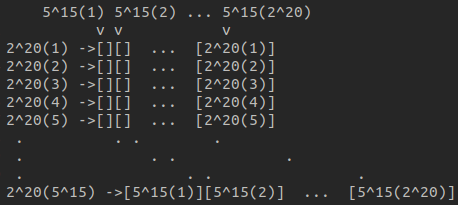

# Extending the power of Totient function

Up to this point we know that $\phi(x)$ where x is prime is = x - 1, and that the multiplicative property holds between primes. 
Now we want to extend this to non-primes. We know that every non-prime is a product of powers of primes, then the first thing to do is know how the Totient function behaves for powers of primes.  
Let's take $p^{k}$. We need to calc. n. of coprimes.  
To solve this in the easiest way possible we can remove those we are sure are not coprimes.
Every number multiplied by 'p' which produces $p^{k}$ is not coprime to $p^{k}$, while every other number from 1 to $p^{k}$ is coprime instead, because 'p' is prime and is only mult. by itself. 
Then: $n * p = p^{k}$   ->   $n = p^{k} / p$   ->   $n = p^{k - 1}$  
Then: $p^{k-1}$ are not coprimes -> $p^{k} - p^{k-1}$ are coprimes -> $\phi(p^{k}) = p^{k} - p^{k-1}$   

## Now the ¿hard? (yes it is) stuff

We know that multiplicativity holds for primes, but here we have $\phi(p^{k}) = p^{k} - p^{k-1}$ where $p^{k}$ is not a prime.  
If we manage to demonstrate that multiplicativity holds for non-primes (powers of primes actually) we can multiply $\phi(p^{k})$ for every p_i, k_i and derive the property for non-primes. This will mean being able to calculate Totient for every integer and being sure the calculation is correct.  

## Example: $\phi(2^{20}5^{15})$

Let's look at the new scheme for this example. Making this has helped me a lot in the process.  

Here becomes clear that removing co-factors will be harder. The previous reasoning scheme holds but now we will have to remove all the columns and lines which are powers of '2' and '5', and for every line and column removed we will need to remove 1 element considered twice and so intersections will be a huge? problem. So we will need to remove for ex: 5^15(2) column, which is composed of 5^15 elements which share the '2' factor, the same goes for 2^20(5) line, here there will be 2^20 elements to remove because they share the '5' factor.  
Let's try to make this as simple as possible (otherwise you alr. know what would happen :'D).
We know that we will have to remove $2^{20} / 2$ columns + $5^{15} / 5$ lines in total, this means: $(2^{20} / 2) * 5^{15} + (5^{15} / 5) * 2^{20}$ and since we will need to sub '1' for every intersection, we will need to sub $5^{15} / 5 * 2^{20} / 2$. Let's write this whole formula:  
$\phi(2^{20}5^{15}) = 5^{15} × 2^{20} − ((2^{19} × 5^{15}) + (5^{14} × 2^{20}) − 5^{14} × 2^{19})$  

## Formalization

$\phi(x^{k}y^{z}) = x^{k}y^{z} - x^{k-1}y^{z} - x^{k}y^{z-1} + x^{k-1}y^{z-1}$ 
$x^{k}y^{z} - x^{k-1}y^{z} - x^{k}y^{z-1} + x^{k-1}y^{z-1} = (x^{k} - x^{k-1})(y^{z} - y^{z-1})$ 
Where: 
$\phi(x^{k}) = x^{k} - x^{k-1}$ 
$\phi(y^{z}) = y^{z} - y^{z-1}$

