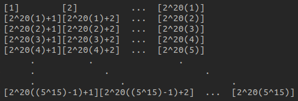

# Totient multiplicativity proof for integers

## Totient for powers of primes

  
  Up to this point we know that $\phi(p) = p - 1$, if $p$ is prime, and that the multiplicative property holds between primes. Now we want to extend the property to non-primes. We know that every non-prime is a product of powers of primes, then the first thing to do is know how the Totient function behaves for powers of primes.
  
Let's take $p^{k}$. We need to calc. the number of coprimes. To solve this in the easiest way possible we can make a slight abstraction and consider $\phi(p)$ as the number of elements of the set $\\{1, 2, \dots, p \\}$ minus the set of multiples of $p$, which for $\phi(p^{1})$ reduces to have 

$\phi(p^{1}) = \phi(p) = |\\{ 1, 2, \dots, p \\} \setminus \\{ p \\}| =  p - 1$

Let's now take for example $\phi(2p)$ into consideration, following our reasoning we have

$\phi(2p) = |\\{ 1, 2, \dots, 2p \\} \setminus \\{ p, 2p \\}| = 2p - 2$

and for $\phi(3p)$

$\phi(3p) = |\\{ 1, 2, \dots, 3p \\} \setminus \\{ p, 2p, 3p \\}| = 3p - 3$

thus, we will have that

$\phi(pp) = \phi(p^{2}) = |\\{ 1, 2, \dots, p^{2} \\} \setminus \\{ p, 2p, 3p, \dots, p^{2} \\}| = p^{2} - p$

Now, let's restart from $p^{2}$, we can see that

$\phi(2p^{2}) = |\\{ 1, 2, \dots, 2p^{2} \\} \setminus \\{ p, 2p, 3p, \dots, p^{2}, p^{2} + p, p^{2} + 2p, p^{2} + 3p, \dots, 2p^{2} \\}| = 2p^{2} - 2p$

then

$\phi(pp^{2}) = \phi(p^{3}) = p^{3} - p^{2}$

and we can formalyze this as

$\phi(p^{k}) = p^{k} - p^{k - 1} = p^{k - 1}(p - 1)$

This is quite hard to figure out and so I'll show another example before going over.

$\phi(2p^{3}) = |\\{ 1, 2, \dots, 2p^{3} \\} \setminus \\{ p, 2p, 3p, \dots, p^{2}, p^{2} + p, p^{2} + 2p, p^{2} + 3p \dots, 2p^{2}, 2p^{2} + p, 2p^{2} + 2p, 2p^{2} + 3p, \dots, 3p^{2}, \dots, p^{3}, p^{3} + p, p^{3} + 2p, p^{3} + 3p, \dots, p^{3} + p^{2}, p^{3} + p^{2} + p, p^{3} + p^{2} + 2p, p^{3} + p^{2} + 3p, \dots, p^{3} + 2p^{2}, \dots, 2p^{3} \\}| = 2p^{3} - 2p^{2}$

To get this last one, just notice how the reasoning up to $p^{3}$ is almost straightforward (it's doable to figure out we have $p^{2}$ elements to remove), then we basically restart from the beginning at $p^{3} + p$, and so we get $2p^{2}$ elements to remove. Then for $pp^{3}$ we will have $pp^{2}$ elements to remove and so on towards infinity.

## Multiplicativity extends Totient to integers

  
  We know that multiplicativity holds for primes, but here we have $\phi(p^{k}) = p^{k} - p^{k - 1}$ where $p^{k}$ is not a prime. 
If we manage to prove that multiplicativity holds for powers of primes we can multiply $\phi(p^{k})$ for every $p_{i}, k_{i}$ and derive the property for integers.
  

### Example: $\phi(2^{20}5^{15})$

  
 
 
 I give you a quick reminder from the previous article regarding Totient multiplicativity, we are basically trying to build a structured multiplication of elements where we will have to remove every multiple of $2$ and $5$. To get the most out of the structure we are trying to collapse each element sharing $5$ and/or $2$ cofactors on the same lines/columns, then remove them and add $1$ for every intersection because we will basically remove those element twice if we don't do so. It's simple from the image to see that the columns are made of $5^{15}$ elements and the lines of $2^{20}$ elements. It's also quite simple to see that we will have to remove half of the columns because are multiples of $2$, thus $2^{19}5^{15}$ elements. Now, to collapse multiples of $5$ we will need swaps. We know there are $5^{14}$ multiples of $5$ (we just saw that $\phi(5^{15}) = 5^{15} - 5^{14}$ holds), and we know these are multiplied by $2^{20}$ elements, and this means that we can swap such elements to build $5^{14}$ lines of $2^{20}$ elements. Finally we will add intersections, and since we are considering $2^{19}$ columns and $5^{14}$ lines there will be $2^{19} \cdot 5^{14}$ intersections. Resuming our reasoning we have

$\phi(2^{20}5^{15}) = 5^{15}2^{20} − 2^{19}5^{15} - 5^{14}2^{20} + 5^{14}2^{19}$

Since the structure above is formalizable for any pair of powers of primes, and the reasoning behind too, the formalization follows.

## Formalization

  
  $\phi(x^{k}y^{z}) = x^{k}y^{z} - x^{k-1}y^{z} - x^{k}y^{z-1} + x^{k-1}y^{z-1}$ 
  $->$ 
  $x^{k}y^{z} - x^{k-1}y^{z} - x^{k}y^{z-1} + x^{k-1}y^{z-1} = (x^{k} - x^{k-1})(y^{z} - y^{z-1})$ 
  $->$ 
  $\phi(x^{k}y^{z}) = (x^{k} - x^{k-1})(y^{z} - y^{z-1})$
  
  where
  
  $\phi(x^{k}) = x^{k} - x^{k-1}$ 
  $\phi(y^{z}) = y^{z} - y^{z-1}$

